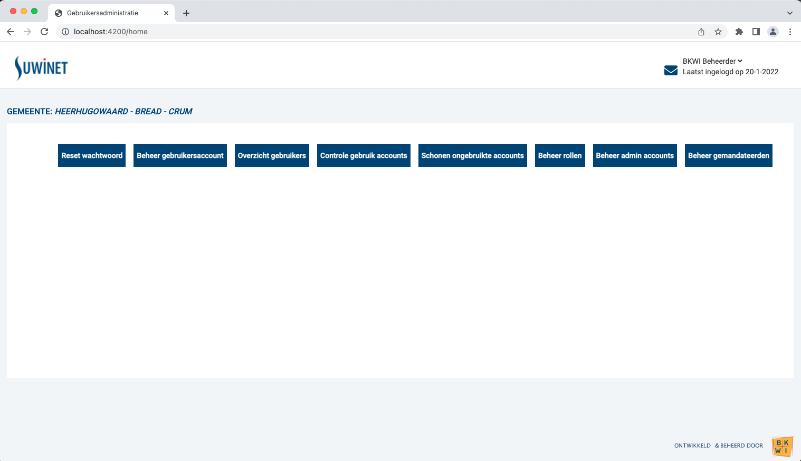
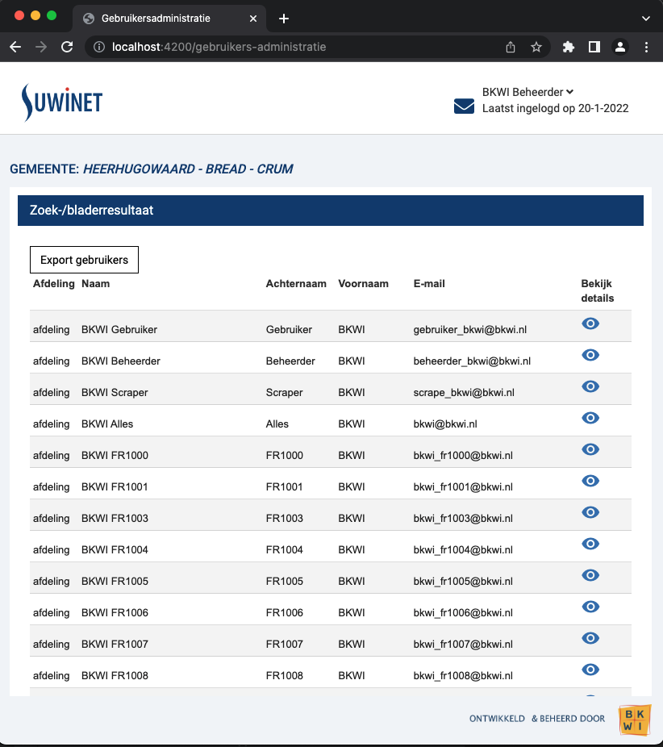

# Uitleg Functionele en Technische Werking GA Frontend

## Landingspagina

Start zowel de backend, api als de frontend. Zie [DeveloperInfo](./5_DeveloperInfo.md) voor meer info.
Ga nu (in Chrome) naar http://localhost:4200 en landingspagina wordt zichtbaar:



De landingspagina is de de home component van de frontend applicatie en staat in:

src/app/home/home.component.ts

De 7 links/buttons staan gewoon hardcoded in de template van de home component:

src/app/home/home.component.html

De home component is als default route ingesteld, waardoor je hier automatisch naar toe
gaat als je naar localhost:4200 navigeert. Dit staat ingesteld in:

src/app/app-routing.module.ts

dmv de regels

```typescript
...
const routes: Routes = [
  {path: '', redirectTo: 'home', pathMatch: 'full'},
  {path: 'home', component: HomeComponent},
    ...  
];
```

## Overzicht gebruikers

Als je op de 3e knop (Overzicht gebruikers) drukt, dan opent de gebruikers lijst zich:



Het gebruikers overzicht bestaat uit een aantal frontend componenten. De component die
geladen wordt bij het indrukken van de button is:

src/app/modules/gebruikers-administratie/components/gebruikers-overzicht/gebruikers-administratie-overzicht.component.ts

Deze component is niet gedefinieerd in de global app module, maar in z'n eigen GebruikersAdministratieModule:

src/app/modules/gebruikers-administratie/gebruikers-administratie.module.ts

In bovenstaande module zijn meerdere componenten gedefinieerd. Deze module is een zogeheten
"lazy" angular module die pas geladen wordt als naar het pad gebruikers-administratie wordt
genavigeerd. Deze navigatie staat gedefinieerd in:

src/app/app-routing.module.ts

dmv de regels

```typescript
...
const routes: Routes = [
    ...
    {
        path: 'gebruikers-administratie',
        loadChildren: () => import('./modules/gebruikers-administratie/gebruikers-administratie.module').then(m => m.GebruikersAdministratieModule)
    }
];
```

De module GebruikersAdministratieModule heeft zijn eigen routes gedefinieerd in:

src/app/modules/gebruikers-administratie/gebruikers-administratie-routing.module.ts

De default route (path: '') wijst naar de component GebruikersAdministratieOverzichtComponent waarmee
uiteindelijk de gebruikers lijst wordt getoond. Lees meer over [Angular Lazy Modules](https://angular.io/guide/lazy-loading-ngmodules)

Door in de template van de component GebruikersAdministratieOverzichtComponent te kijken 
(src/app/modules/gebruikers-administratie/components/gebruikers-overzicht/gebruikers-administratie-overzicht.component.html)
zie je dat gebruik wordt gemaakt van meerdere componenten:

- app-bkwi-panel (src/app/modules/gebruikers-administratie/components/bkwi-panel)
- app-gebruikers-table (src/app/modules/gebruikers-administratie/components/gebruikers-table)

Door gebruik te maken van meerdere componenten wordt hergebruik bevorderd en wordt onderhoud makkelijker.

### GebruikersTableComponent (app-gebruikers-table)

De component GebruikersTableComponent is verantwoordelijk voor het renderen van een object van het type IGebruikersTableMessage.
Het type IGebruikersTableMessage is gedefinieerd in src/app/modules/gebruikers-administratie/gebruikers-administratie.types.ts.
Voor een java ontwikkelaar zijn dit soort typescript types wellicht vreemd. Het idee van het type IGebruikersTableMessage is
dat er ofwel een fout in het object zit, ofwel een array van gebruikers. De frontend service (GebruikersFrontendService)
is verantwoordelijk voor het beschikbaar maken van het object templateData$ van het type IGebruikersTableMessage dat direct
door de gebruikers table component getoond kan worden. De $ op het eind van de naam van dit object is om aan te geven
dat het een Observable is, dit is puur een conventie in Angular. De Observable wordt door de template gebruikt en dmv
de async pipe van asynchroon weer synchroon gemaakt. Dit is het zogeheten "Reactive Programming": vanuit typescript 
services en componenten worden Observables opgehaald en via RxJS operators bewerkt. De template subscribed uiteindelijk op de 
observable en gebruikt de data. Dit subscriben gaat met deze regel:

```html
  <ng-container *ngIf="this.templateData$ | async as templateData">
```

Met bovenstaande constructie wordt de Observable beschikbaar gemaakt onder de naam templateData, waarna de rest van 
template direct de templateData kan gebruiken alsof het een (synchrone) variabele is. Lees meer over de [Angular Async Pipe](https://ultimatecourses.com/blog/angular-ngif-async-pipe).

### Backend Service en Frontend Service

Zoals in de vorige paragraaf uitgelegd is de Frontend Service verantwoordelijk voor het beschikbaar stellen van de data
voor de GebruikersTableComponent in zijn eigen formaat (IGebruikersTableMessage). De Frontend Service benaderd echter
niet het rest endpoint van de backend, want dat doet de GebruikersAdministratieBackendService (src/app/services/gebruikers-administratie-backend.service.ts).
De backend service benadert het rest endpoint van de backend dmv de Angular http client (https://angular.io/guide/http).
De lijst van gebruikers wordt met deze regels code opgehaald:

```typescript
    getGebruikers(): Observable<Gebruiker[]> {
        const url = this.url + '/gebruikers';
        return this.httpClient.get<Gebruiker[]>(`${url}`)
            .pipe(
              catchError((err) => this.catchHttpError(err))
            );
    }
```

De backend service maakt een Observable van het type Gebruiker[], dus een array van gebruikers. De table component heeft
echter het type IGebruikersTableMessage nodig. Deze conversie gebeurt in de Frontend Service in de volgende regels:

```typescript
    getGebruikers(): Observable<IGebruikersTableMessage> {
        return this.gebruikersAdministratieBackendService.getGebruikers().pipe(
            map((responseData) => {
                return {
                    data: responseData
                }
            }),
            catchError((err) => {
                console.log('Error:', err)
                return of({
                    error: {
                        errorMessage: `Error: ${err.message || err.toString()}`,
                    }
                })
            })
        )
    }
```

In bovenstaande code wordt veelvuldig gebruik gemaakt van RxJS operators. Met [map](https://www.learnrxjs.io/learn-rxjs/operators/transformation/map) wordt
het de observable van de backend service getransformeerd naar Observable<IGebruikersTableMessage>, waarbij het veld data
gevuld wordt d.m.v. de data uit de backend service. Met de RxJS operator [catchError](https://www.learnrxjs.io/learn-rxjs/operators/error_handling/catch) 
wordt een error gecached. Hiermee wordt het veld error uit IGebruikersTableMessage gevuld. Als we kijken naar de definitie van het type
IGebruikersTableMessage, dan zien we dat beide velden optioneel zijn (dankzij het ? symbool):

```typescript
export interface IGebruikersTableMessage {
    data?: IGebruikersTableData
    error?: IGebruikersTableError
}
```

De template om de data nu te tonen wordt nu qua logica heel simpel: Als er een error is, dan wordt de error getoond, 
anders wordt de data getoond:

```angular2html
  <ng-container *ngIf="this.animate">
    <!--Toon animation, zolang de animate flag in component true is -->
    <mat-progress-bar mode="indeterminate"></mat-progress-bar>
  </ng-container>
    <!--
        Zodra de templateData$ observable in de component beschikbaar is, subscribe en maak de data beschikbaar onder de 
        naam 'templateData'
     -->
  <ng-container *ngIf="this.templateData$ | async as templateData">
    <!--Als er een error, toon dan de error -->
    <ng-container *ngIf="templateData.error">
      <div class="alert-danger">
        <h3>An error occurred!</h3>
        <p> {{ templateData.error.errorMessage }}</p>
      </div>
    </ng-container>

    <!--Als de data er is, toon dan de data -->
    <ng-container *ngIf="templateData.data" >
        ...

```

## Wachtwoord wijzigen inclusief details

Vanaf de lijst van gebruikers kan naar een specifieke gebruiker worden genavigeerd dmv het oogje. Deze pagina is 
bedoeld om een wachtwoord te wijzigen (door de beheerder) en details van de gebruiker te tonen. Deze pagina wordt
gemaakt door deze angular component:

src/app/modules/gebruikers-administratie/components/gebruikers-detail/gebruikers-detail.component.ts

Deze component gebruikt ook een speciaal type om de data in de template weer te geven: IGebruikerMessage. In dit type
kan zowel een error als een enkele gebruiker zitten. Ook hier zie je het patroon dat de backend service het rest endpoint
aanspreekt en dat de frontend service de data in het juiste formaat zet. De services werken met Observables en pas in de
template wordt er geabboneerd op de Observable en wordt de data weer synchroon gemaakt. 
Ik (Marnix) moest als java ontwikkelaar, gewend aan de imperative manier van werken, erg wennen aan het 'reactive programming'.

## Export
De export functionaliteit wordt aangeroepen d.m.v. de export knop op boven het gebruikers overzicht. Deze knop roept
direct een endpoint aan die een binaire file teruggeeft. De frontend roept uitsluitend deze url aan, verder bevat de
frontend geen logica voor de export. 

[back to main](../README.md) |
[previous](./10_Upgrade_to_Angular_14.md) |
[next](./12_Unit_test_dekking.md)