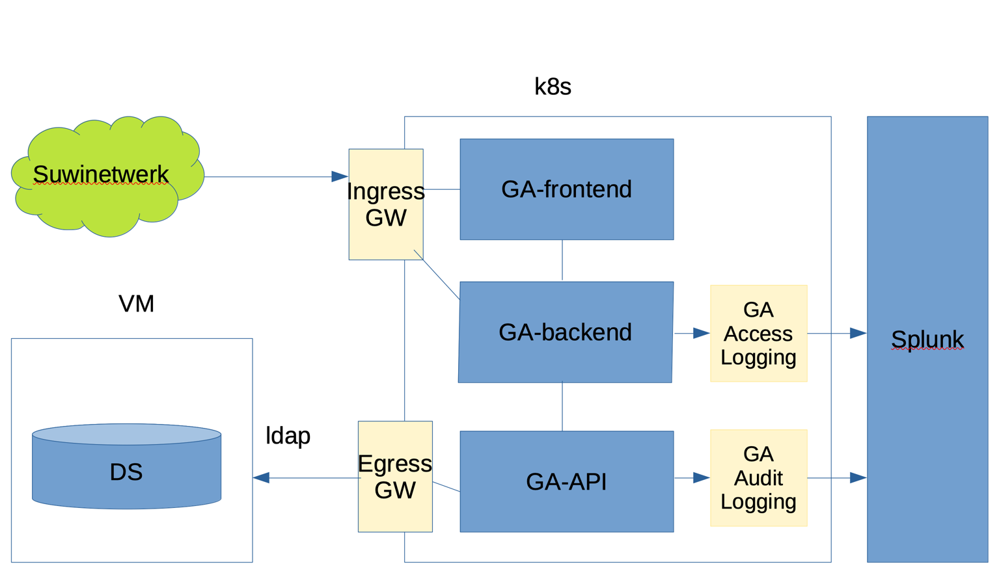

# Overzicht van functionele eisen / implementatie voor de implementatie van de gebruikersadministratie

[[_TOC_]]

## Introductie

In het kader van het uitfaseren van Suwinet Inkijk (SI) Classic wordt de gebruikersadministratie zelfstandig 
opgzet.

## Overzicht van functionele eisen

Overzicht van de implementatie en verbinding met de omgeving.

[back to main](../README.md) |
[previous](./1_Legenda.md) |
[next](./3_Beschrijving_huidige_situatie_SI_Classic.md)
