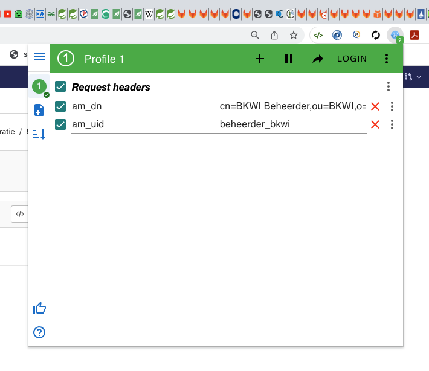
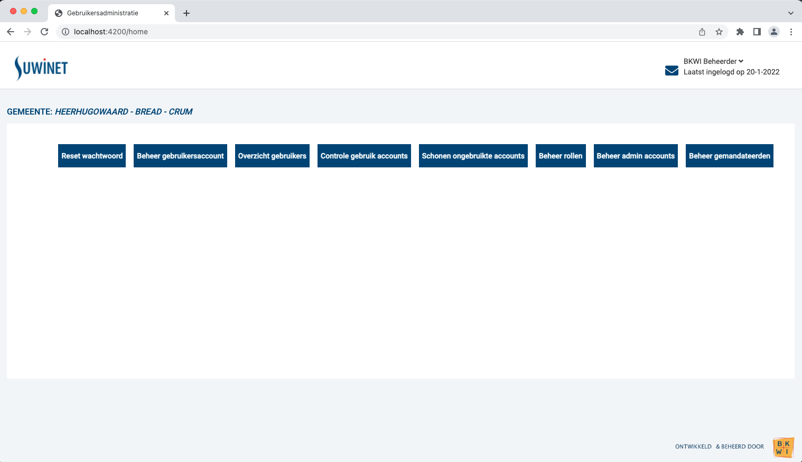

# Informatie om de functionaliteit uit te kunnen voeren

[[_TOC_]]

## Introductie

In het kader van dit project worden 4 applicatiess via Gitlab / Kubernetes opgeleverd.
In dit hoofdstuk wordt beschreven wat het verband tussen de applicaties is en hoe ze opgestart worden.

## Documentatie

1. [Distinguished Names](https://docs.microsoft.com/en-us/previous-versions/windows/desktop/ldap/distinguished-names)
2. [LDAP: Lightweight Directory Access Protocol](https://en.wikipedia.org/wiki/Lightweight_Directory_Access_Protocol)
3. [LDAP ADsPath](https://docs.microsoft.com/en-us/windows/win32/adsi/ldap-adspath)
4. [Spring Boot + Spring Security + LDAP from scratch - Java Brains](https://www.youtube.com/watch?v=-wDUChgvYgU)
5. [Spring: Authenticating a User with LDAP](https://spring.io/guides/gs/authenticating-ldap/)
6. [Baeldung: Guide to Spring Data LDAP](https://www.baeldung.com/spring-data-ldap)
7. [Baeldung: Spring LDAP Overview](https://www.baeldung.com/spring-ldap)
8. [spring-ldap API](https://docs.spring.io/spring-ldap/docs/current/apidocs/)
9. [Spring LDAP Overview](https://spring.io/projects/spring-ldap#overview)
10. [Spring Data LDAP - Reference Documentation](https://docs.spring.io/spring-data/ldap/docs/current/reference/html/#reference)
11. [Swagger Implementation for Webflux functional programming model](https://medium.com/walmartglobaltech/swagger-implementation-for-webflux-functional-programming-model-8ac55bfce2be)
12. [Sending HTTP requests with Spring WebClient](https://reflectoring.io/spring-webclient/)
13. [Spring WebFlux Filters with Controllers and Functional Routers](https://www.amitph.com/spring-webflux-filters/)
14. [Baeldung: Spring WebFlux Filters](https://www.baeldung.com/spring-webflux-filters)


## Overzicht van de gebruikte repos

### Gerrit / Jenkins

In sas wordt voor lokaal ontwikkelwerk gebruik gemaakt van een ldap docker container.  
Het image daarvoor is aanwezig in sas:

- $ws/sas/docker/docker-compose-ldap.yml

### Gitlab / kubernetes

Voor de nieuwe gebruikersadministratie hebben we de volgende 5 GIT repositories:

- https://gitlab.bkwi.nl/bp/pm/ba/services-inkijk/gebruikers-administratie-ldap-stub
  - Deze is opgezet met het image, dat lokaal via $ws/sas/docker/docker-compose-ldap.yml opgestart wordt.
- https://gitlab.bkwi.nl/bp/pm/ba/services-inkijk/gebruikers-administratie-api
- https://gitlab.bkwi.nl/bp/pm/ba/services-inkijk/gebruikers-administratie-contract
- https://gitlab.bkwi.nl/bp/pm/ba/services-inkijk/gebruikers-administratie-backend-springboot
- https://gitlab.bkwi.nl/bp/pm/ba/services-inkijk/gebruikers-administratie-frontend-angular

## Technisch overzicht

Een technisch overzicht van de 3 onderdelen van de gebruikersadministratie, frontend, backend en api
is te vinden in

[gebruikersadministratie-technisch-overzicht.pdf](./documents/gebruikersadministratie-technisch-overzicht.pdf)

## Wijze van opstarten

In de browser moet de [ModHeader](https://gitlab.bkwi.nl/bp/pm/ba/gebruikersadministratie-documentatie/-/blob/master/documentatie-gebruikersadministratie/5_DeveloperInfo.md#benaderen-van-de-rest-applications-via-swagger-en-inloggen-op-de-frontend)
ingesteld staan als hieronder beschreven.

In het algemeen, tenzij anders besproken, worden de projecten in de IDE (IntelliJ) opgestart.  
De bedoeling is om de functionaliteit in de onderstaande volgorde op te starten:
1. $ws/sas/docker/docker-compose-ldap.yml
2. https://gitlab.bkwi.nl/bp/pm/ba/services-inkijk/gebruikers-administratie-api
3. https://gitlab.bkwi.nl/bp/pm/ba/services-inkijk/gebruikers-administratie-backend-springboot
4. https://gitlab.bkwi.nl/bp/pm/ba/services-inkijk/gebruikers-administratie-frontend-angular

**Wijziging van de volgorde kan tot onverklaarbare fouten leiden!**

## Gebruikersadministratie LDAP Stub

### Implementatie

Om het API project te laten draaien in O en T willen we een ldap stub maken. We hebben hiervoor het volgende Gitlab
project:

https://gitlab.bkwi.nl/bp/pm/ba/services-inkijk/gebruikers-administratie-ldap-stub

Hier wil ik nu het volgende docker image in hebben:

https://harbor.bkwi-am3-bto.eqap.io/harbor/projects/2/repositories/database_opendj/artifacts/sha256:a7886015021a7cf4f9798382a1d98f9e3f8f82318f2776251a2359a57ffc4d74

Ik moet dit image eerst naar mijn lokale docker omgeving halen:

```shell
  $ docker pull registry-bto.bkwi.nl/bkwi/database_opendj:7584705
```

Vervolgens moet ik hem retaggen:

```shell
  $ docker tag registry-bto.bkwi.nl/bkwi/database_opendj:7584705 gitlab.bkwi.nl:4567/bp/pm/ba/services-inkijk/gebruikers-administratie-ldap-stub:latest
```

Het getagde image moet nu worden gepushed naar gitlab:

```shell
  $ docker push gitlab.bkwi.nl:4567/bp/pm/ba/services-inkijk/gebruikers-administratie-ldap-stub:latest
```

In de container registry van Gitlab is het image nu zichtbaar:

https://gitlab.bkwi.nl/bp/pm/ba/services-inkijk/gebruikers-administratie-ldap-stub/container_registry

## LDAP lokaal

### Opzet van docker-compose-ldap.yml

Lokaal (voor het moment) is een file **docker-compose-ldap.yml** aanwezig => in het sas project in de docker folder.  
Deze is gebaseerd of de docker image, zoals die aanwezig is in de huidige harbor repository.  
Die bevat dus de content, bedoeld voor lokaal gebruik in SI Upgrade.

```yaml
version: '3.7'

# Generated by createDockerEnv.sh

services:
  ldap:
    image: "${REGISTRY}/database_opendj:${TAG}"
    expose:
      - "4444"
      - "50389"
      - "50636"
    ports:
      - "389:50389"
      - "636:50636"
    healthcheck:
      test: ["CMD", "/opt/opendj/bin/ldapsearch", "--port", "50389", "--bindDN", "cn=Directory Manager", "--bindPassword", "vagrant", "--baseDN", "ou=bkwi,o=suwi,c=nl", "--searchScope", "one", "(objectClass=organizationalunit)", "dn" ]
      interval: 30s
      timeout: 5s
      retries: 1

```

Noot:
Omdat nu de Org.forgerock.opendj ldap library voor de verbinding gebruikt wordt, en die gebruikt **ldaps** wordt  
exposed via port 636.

Zie application-dev.yml.

### Starten en stoppen van docker-compose-ldap.yml via de command-line:

```shell
$ docker-compose --file $ws/sas/docker/docker-compose-ldap.yml --project-name inkijk up
$ docker-compose --file $ws/sas/docker/docker-compose-ldap.yml --project-name inkijk down
```

Als onderdeel van het starten wordt het volgende zichtbaar:
```shell
Creating inkijk_ldap_1 ... done
Attaching to inkijk_ldap_1
ldap_1  | [23/Feb/2022:14:39:21 +0100] category=CORE severity=NOTICE msgID=134 msg=ForgeRock Directory Services 6.5.2 (build 20190612083904, revision number 210e98489950374e28f1f979ecf640211c7fdeef) starting up
ldap_1  | [23/Feb/2022:14:39:21 +0100] category=JVM severity=NOTICE msgID=21 msg=Installation Directory:  /opt/opendj
ldap_1  | [23/Feb/2022:14:39:21 +0100] category=JVM severity=NOTICE msgID=23 msg=Instance Directory:      /opt/opendj
ldap_1  | [23/Feb/2022:14:39:21 +0100] category=JVM severity=NOTICE msgID=17 msg=JVM Information: 1.8.0_212-b04 by IcedTea, 64-bit architecture, 3732406272 bytes heap size
ldap_1  | [23/Feb/2022:14:39:22 +0100] category=JVM severity=NOTICE msgID=18 msg=JVM Host: ccad3b1f4447, running Linux 5.10.76-linuxkit amd64, 16789729280 bytes physical memory size, number of processors available 6
ldap_1  | [23/Feb/2022:14:39:22 +0100] category=JVM severity=NOTICE msgID=19 msg=JVM Arguments: "-Dcom.sun.jndi.ldap.object.disableEndpointIdentification=true", "-Dorg.opends.server.scriptName=start-ds"
ldap_1  | [23/Feb/2022:14:39:24 +0100] category=BACKEND severity=NOTICE msgID=513 msg=The database backend suwiRoot containing 4798 entries has started
ldap_1  | [23/Feb/2022:14:39:25 +0100] category=EXTENSIONS severity=NOTICE msgID=221 msg=DIGEST-MD5 SASL mechanism using a server fully qualified domain name of: kaniko-169-opendj-7c4dc84c5c-lv4wx
ldap_1  | [23/Feb/2022:14:39:26 +0100] category=PROTOCOL severity=NOTICE msgID=276 msg=Started listening for new connections on Administration Connector 0.0.0.0 port 4444
ldap_1  | [23/Feb/2022:14:39:26 +0100] category=PROTOCOL severity=NOTICE msgID=276 msg=Started listening for new connections on LDAP 0.0.0.0 port 50389
ldap_1  | [23/Feb/2022:14:39:26 +0100] category=PROTOCOL severity=NOTICE msgID=276 msg=Started listening for new connections on LDAPS 0.0.0.0 port 50636
ldap_1  | [23/Feb/2022:14:39:26 +0100] category=CORE severity=NOTICE msgID=135 msg=The Directory Server has started successfully
ldap_1  | [23/Feb/2022:14:39:26 +0100] category=CORE severity=NOTICE msgID=139 msg=The Directory Server has sent an alert notification generated by class org.opends.server.core.DirectoryServer (alert type org.opends.server.DirectoryServerStarted, alert ID org.opends.messages.core-135): The Directory Server has started successfully
```

### Bevragen van de ldap instance

```shell
$  docker exec -it inkijk_ldap_1 /opt/opendj/bin/ldapsearch \
   --port 50389 -D 'cn=sa_useradmin,o=special,c=nl' -w vagrant \
   --baseDn o=suwi,c=nl "(uid=*veenendaal*)" ui
dn: cn=Abel van Dummy Gemeente Veenendaal,ou=Dummy Gemeente Veenendaal,ou=gsd,o=suwi,c=nl

dn: cn=Ans VD Werkzoekende,ou=Dummy Gemeente Veenendaal,ou=gsd,o=suwi,c=nl

dn: cn=Babet van Dummy Gemeente Veenendaal,ou=Dummy Gemeente Veenendaal,ou=gsd,o=suwi,c=nl

dn: cn=Chris van Dummy Gemeente Veenendaal,ou=Dummy Gemeente Veenendaal,ou=gsd,o=suwi,c=nl

dn: cn=Henk van Dummy Gemeente Veenendaal,ou=Dummy Gemeente Veenendaal,ou=gsd,o=suwi,c=nl

dn: cn=Henk VD Handhaven,ou=Dummy Gemeente Veenendaal,ou=gsd,o=suwi,c=nl

dn: cn=Jan van Dummy Gemeente Veenendaal,ou=Dummy Gemeente Veenendaal,ou=gsd,o=suwi,c=nl

dn: cn=Piet VD Uitkeren,ou=Dummy Gemeente Veenendaal,ou=gsd,o=suwi,c=nl

dn: cn=Pietje van Dummy Gemeente Veenendaal,ou=Dummy Gemeente Veenendaal,ou=gsd,o=suwi,c=nl

dn: cn=Abel van Veenendaal,ou=Veenendaal,ou=gsd,o=suwi,c=nl

dn: cn=Babet van Veenendaal,ou=Veenendaal,ou=gsd,o=suwi,c=nl

dn: cn=Chris van Veenendaal,ou=Veenendaal,ou=gsd,o=suwi,c=nl

dn: cn=Henk van Veenendaal,ou=Veenendaal,ou=gsd,o=suwi,c=nl

dn: cn=Jan van Veenendaal,ou=Veenendaal,ou=gsd,o=suwi,c=nl

dn: cn=Pietje van Veenendaal,ou=Veenendaal,ou=gsd,o=suwi,c=nl

dn: cn=Jan van Veenendaal,ou=Veenendaal,ou=wgs,o=suwi,c=nl
```

### Voorbeeld van een gebruiker, gedefinieerd in LDAP

```shell
dn: uid=ben,ou=people,dc=springframework,dc=org
objectclass: top
objectclass: person
objectclass: organizationalPerson
objectclass: inetOrgPerson
cn: Ben Alex
sn: Alex
uid: ben
userPassword: $2a$10$c6bSeWPhg06xB1lvmaWNNe4NROmZiSpYhlocU/98HNr2MhIOiSt36
```

### Benaderen van de REST applications via Swagger en inloggen op de frontend

Om de REST applicaties (ga-api, ga-backend-springboot) en de Angular applicatie lokaal te kunnen inloggen kun je door middel van
de [mod_header](https://chrome.google.com/webstore/detail/modheader/idgpnmonknjnojddfkpgkljpfnnfcklj?hl=nl)
Chrome plugin de volgende headers zetten:

1. am_dn
2. am_uid

De waardes voor een gebruiker kun je vinden in $ws/sas/docker/opendj/seed/import_users.ldif.

Voorbeeld:
```shell
am_dn = cn=BKWI Beheerder,ou=BKWI,o=suwi,c=nl
am_uid = beheerder_bkwi
```

Dit ziet dan als volgt uit in Chrome in de Modheader plugin (let erop, dat de Request Headers aangevinkt, cq. actief zij):  


Het gebruik van de ModHeader is een simulatie van de situatie in productie, waarbij het Angular frontend door SI Upgrade
aangeroepen wordt en deze header parameters meegegeven worden.

## Health check

Het volgende geldt voor de applicaties:  
- gebruikers-administratie-api
- gebruikers-administratie-backend-springboot

In application.yml is zoals genoemd in de **Opzet applicatie** een basis configuratie aanwezig.  
Voor de werking van deze configuratie moet in **pom.xml** het volgende aanwezig zijn:

```xml
    <!-- On behalf of health checks -->
    <dependency>
      <groupId>org.springframework.boot</groupId>
      <artifactId>spring-boot-starter-actuator</artifactId>
    </dependency>
```

Als de applicatie draait (met server.port = 2021; zie application.yml) dan kan een health check uitgevoerd worden.
Dit zal ook plaats vinden in de bouwstraat. De healt check kan ook lokaal uitgevoerd worden:

```shell
$ curl localhost:2021/health | jq .
  % Total    % Received % Xferd  Average Speed   Time    Time     Time  Current
                                 Dload  Upload   Total   Spent    Left  Speed
100    15  100    15    0     0    681      0 --:--:-- --:--:-- --:--:--   681
{
  "status": "UP"
}

```

## Uitvoer van Jib.

In de bouwstraat wordt in de pipeline de script **Create-image** uitgevoerd: stap **jib-build**.  
Hiervoor moet in **pom.xml** het volgende aanwezig zijn:

```xml
<plugin>
  <groupId>com.google.cloud.tools</groupId>
  <artifactId>jib-maven-plugin</artifactId>
  <version>3.2.1</version>
  <configuration>
    <from>
      <image>gcr.io/distroless/java17-debian11</image>
    </from>
    <to>
      <image>gitlab.bkwi.nl:4567/inkijk/gebruikersadministratie/${project.artifactId}</image>
    </to>
    <container>
      <jvmFlags>
        <jvmFlag>-XshowSettings:VM</jvmFlag>
        <jvmFlag>-XX:MaxRAMPercentage=75</jvmFlag>
      </jvmFlags>
    </container>
  </configuration>
</plugin>
```

Hierbij moet de naam **gebruikers-administratie-api** voor een andere applicatie aangepast worden.


## Gebruikersadministratie API

De gebruikersadministratie API ontsluit de gebruikersgegevens.

De implementatie van de API is een Spring boot applicatie met verschillende REST endpoints. De
implementatie van de API maakt op dit moment gebruik van OpenAM om gebruikersgegevens op te halen
uit de lokale LDAP database. De implementatie van de API maakt op dit moment gebruik van gekopieerde sas-classes:

```
package nl.bkwi.services.useradmin.ldap.commands 
# gekopieerd van
$ws/sas/services/useradmin/src/main/java/nl/bkwi/services/useradmin/ldap/commands/SearchUsersByFilterCommand.java
```

### Gebruikersadministratie API starten

Zorg dat er in IntelliJ in de runtime configuratie in de CLI argumenten --spring.profiles.active=dev
staat.

Notabene: voor de uitvoer van de BDD-tests moet de applicatie aanstaan.

### Gebruikersadministratie API benaderen via Swagger

Na opstarten in dev mode is de applicatie te benaderen via:
- http://localhost:2021/webjars/swagger-ui/index.html#/
- Afhankelijk van de REST functie zijn **am_dn** (zie boven) en een **uid** (b.v. 'rkremers') benodigd.

In het volgende wordt een overzicht van de Swagger web-pagina gegeven:  


## Gebruikersadministratie contract

Het project gebruikers-administratie-contract wordt initieel als volgt opgezet:
- Van de Swagger pagina (zie boven) kan onder **/v3/api-docs*** een json file gedownload worden.
  Dit is de basis van het contract.
- Op de website [editor.swagger.io/](https://editor.swagger.io/) kan de json file gecontroleerd en naar yaml format
  omgezet worden. Hier kan evt ook nog een eerste test uitgevoerd worden en een overeenkomstig curl command gedownload
  worden.
- Vervolgens wordt in IntelliJ een basis-project aangemaakt.
  - De yaml file wordt hier geplaatst: 
    - gebruikers-administratie-contract/src/main/resources/api-docs-contract-v01.yml
  - In pom.xml wordt de plugin **openapi-generator-maven-plugin** toegevoegd.
    - De configuratie van de plugin is van het internet gehaald.
    - inputSpec: ${project.basedir}/src/main/resources/api-docs-contract-v01.yml
    - modelPackage: nl.bkwi.gebruikersadministratie.dto
- Na compilatie is in **gebruikers-administratie-contract/target/generated-sources/** de gegenereerde sourcecode aanwezig.
- In geval van volgenede wijzigingen kan de yaml file aangepast worden. 
- In het project is aanwezig:
  - /.mvn/jgitver.config.xml
    - Regelt automatisch tag verhoging in Gitlab.


## Gebruikersadministratie Backend Spring Boot

###  Gebruikersadministratie backend starten

Zorg dat er in IntelliJ in de runtime configuratie in de CLI argumenten --spring.profiles.active=dev
staat.
Notabene: voor de uitvoer van de BDD-tests moet de applicatie aanstaan.

### Gebruikersadministratie backend benaderen via Swagger

Na opstarten in dev mode is de applicatie te benaderen via:
- http://localhost:2020/webjars/swagger-ui/index.html#/
- Afhankelijk van de REST functie is een uid (b.v. 'rkremers') benodigd.

In het volgende wordt een overzicht van de Swagger web-pagina gegeven:


### Authenticatie Filter t.b.v. de System User, op basis van request header parameters am_dn en am_uid.

In het volgende wordt beschreven op welke manier de request header parameters **am_dn** en **am_uid** toegepast worden.
Deze twee header parameters worden geleverd via de Chrome [ModHeader](https://gitlab.bkwi.nl/bp/pm/ba/gebruikersadministratie-documentatie/-/blob/master/documentatie-gebruikersadministratie/5_DeveloperInfo.md#benaderen-van-de-rest-applications-via-swagger-en-inloggen-op-de-frontend).
Dit is een simulatie van de situatie, dat de gebruikers-administratie via SI Upgrade aangeroepen wordt en waarbij deze
parameters meegegeven worden.

In elke endpoint is één van de input parameters:  

```java
@RequestAttribute("principal") Optional<SystemUser> systemUser

// Voorbeeld:
public class GebruikerController {
  @GetMapping()
  public Flux<UiGebruikerDTO> retrieveGebruikers(
          @RequestAttribute("principal") Optional<SystemUser> systemUser) {
    return gebruikerService.getGebruikers(systemUser);
  }

}
```

Deze **systemUser** wordt niet direct meegegeven, maar wordt via een WebFlux WebFilter samengesteld op basis van
de request header parameters **am_dn** en **am_uid**.

In Class AuthFilter, die WebFlux interface WebFilter implementeert, worden de request parameters afgevangen en op 
basis hiervan wordt een nieuwe instance van de class SystemUser aangemaakt.  
Deze instance wordt vervolgens als @RequestAttribute("principal") meegegeven aan de endpoints.

Het gevolg hiervan is, dat in [Swagger voor gebruikers-administratie-backend-springboot](https://gitlab.bkwi.nl/bp/pm/ba/gebruikersadministratie-documentatie/-/blob/master/documentatie-gebruikersadministratie/5_DeveloperInfo.md#gebruikersadministratie-backend-benaderen-via-swagger)
in Chrome de aanroep van de REST endpoints wel werkt, omdat de request header parameters daar via [ModHeader](https://gitlab.bkwi.nl/bp/pm/ba/gebruikersadministratie-documentatie/-/blob/master/documentatie-gebruikersadministratie/5_DeveloperInfo.md#benaderen-van-de-rest-applications-via-swagger-en-inloggen-op-de-frontend)
meegegeven worden, maar de curl commands, die in Swagger gekopieerd worden kunnen niet werken.

Voorbeeld:
- http://localhost:2020/webjars/swagger-ui/index.html#/gebruiker-controller/getGebruiker

```shell
# Curl command, gekopieerd van Swagger:
curl -X 'GET' \
  'http://localhost:2020/backend/gebruikers/rkremers' \
  -H 'accept: */*' | jq .
#Result:
  % Total    % Received % Xferd  Average Speed   Time    Time     Time  Current
                                 Dload  Upload   Total   Spent    Left  Speed
100   160  100   160    0     0  12786      0 --:--:-- --:--:-- --:--:-- 32000
{
  "timestamp": "2022-08-25T08:33:04.328+00:00",
  "path": "/backend/gebruikers/rkremers",
  "status": 401,
  "error": "Unauthorized",
  "message": null,
  "requestId": "388557eb-12"
}

# Curl command na toevoeging van de request header parameters
curl -X 'GET' \
  'http://localhost:2020/backend/gebruikers/rkremers' \
  -H 'am_dn: cn=BKWI Beheerder,ou=BKWI,o=suwi,c=nl' \
  -H 'am_uid: rkremers' \
  -H 'accept: */*' | jq .
# Result:
  % Total    % Received % Xferd  Average Speed   Time    Time     Time  Current
                                 Dload  Upload   Total   Spent    Left  Speed
100   213  100   213    0     0   7240      0 --:--:-- --:--:-- --:--:-- 12529
{
  "naam": "rkremers",
  "inlognaam": "rkremers",
  "achternaam": "kremers",
  "voornaam": "rkremers",
  "userId": "rkremers",
  "initialen": null,
  "email": "rkremers@bkwi.nl",
  "telefoonnummer": null,
  "afdeling": "afdeling",
  "employeeNr": null
}
```

## Frontend Angular

De frontend is initieel gemaakt met angular-cli (https://angular.io/cli)

- NodeJS versie 17.0.1
- NPM versie 8.3.1

### Frontend starten

    $ ng serve

De frontend wordt geopend op http://localhost:4200. 

### Gebruikers overzicht

Vanaf de landingspagina zie je een aantal knoppen staan, waaronder de knop "Overzicht gebruikers":



Klik op de knop en een lijst van gebruikers wordt getoond:


### Detail overzicht van een gebruiker

Als op de lijst van gebruikers een gegeven gebruiker aangeklikt wordt dan dienen de details van die gebruiker
te verschijnen. Dat ziet dan (ongeveer) als volgt uit:


### Gebruikers export

De lijst van gebruikers bevat een "Export gebruikers" knop. Door hier op te klikken wordt er een CSV gedownload met 
dezelfde gebruikers als in de lijst. 

### Unittesten starten

    $ ng test

### Added libraries

#### Angular Material library

- [Angular Material library](https://material.angular.io/)
    - Installatie:

```shell
$ cd $ws/gebruikers-administratie-frontend-angular
$ ng add @angular/material
```

### Styling

Voor styling zal gekeken worden naar de opzet van Nikita:
- https://office.bkwi.nl/
    - Openbare bestanden / Algemeen / Nikita / opleveren / Suwinet_inkijk / Prototype

Verder zal gebruik gemaakt worden van:

- Angular Material
-
gebruikers-administratie-frontend-angular/src/assets/bootstrap/src/main/webapp/bootstrap/css/bootstrap.css

### Angular Best Practices

- https://www.tatvasoft.com/blog/angular-optimization-and-best-practices/
- https://medium.com/geekculture/angular-project-folder-structure-file-naming-conventions-and-simplifying-imports-c37701cd2bf0
- https://dev-academy.com/angular-architecture-best-practices/
- https://angular-enterprise.com/en/ngpost/courses/design-patterns/

[back to main](../README.md) |
[previous](./4_Beschrijving_Implementatie_OpenAM.md) |
[next](./6_DeployInfo.md)


