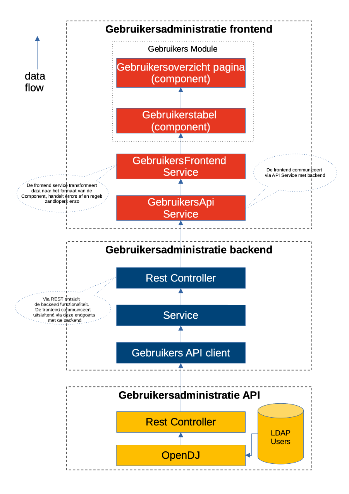

# Authenticatie

[[_TOC_]]

## Introductie

De gebruikersadministratie applicatie zit achter een zogeheten Identity Gateway wat zorgt dat de applicatie uitsluitend benaderd kan worden door een gebruiker die geauthenticeerd is. 
De functionaliteit voor deze Identity Gateway bestond al in het BKWI applicatie landschap en wordt gerealiseerd door het product OpenAM.

## Filter geauthenticeerde gebruiker

De applicatie kan alleen benaderd worden door een geauthenticeerde gebruiker. Binnen de applicatie wordt deze gebruiker verder gebruikt voor o.a. de benadering van de LDAP server. 
De applicatie vraagt daarom via de header in elk request de gebruikersnaam van de ingelogde gebruiker op. 

De backend applicatie leest de volgende headers uit bij elk request dmv een Filter (AuthFilter):

1. "am_dn"
2. "am_uid"

Deze 2 headers worden uitgelezen, waarna er een SystemUser wordt gemaakt die als Principal in de applicatie wordt gebruikt. Principal is een spring-security begrip en 
geeft de huidige ingelogde gebruiker van de applicatie aan.

### LDAP server benaderen met geauthenticeerde gebruiker

De backend applicatie communiceert met een andere applicatie om de ldap gegevens op te halen. De andere applicatie is de gebruikersadministratie-api applicatie. Hiermee 
is de benadering van LDAP ontkoppelt van de backend applicatie. De class GebruikerApiClient uit het backend project  maakt verbinding met de api applicatie dmv WebClient. 
De WebClient verbinding wordt geconfigureerd dmv de class AppConfig die z'n configuratie uit de yaml files haalt (afhankelijk van profiel).
De gebruikersadministratie-api applicatie benadert de LDAP server d.m.v. de repository class OpenDJUserAdminDao. De functionaliteit is gebaseerd op de code van het 
SAS Upgrade project. 
Via dezelfde header als gebruikt in de backend applicatie wordt de huidige gebruiker bepaald (am_dn). Deze huidige gebruiker wordt gebruikt bij het maken van een verbinding met
de LDAP server. Voordeel van deze benadering is dat de LDAP-server uitsluitend informatie teruggeeft die door deze huidige gebruiker gelezen mag worden. De LDAP server wordt benaderd
via de java libraries behorend bij het product Forgerock Directory Services (v6.5.2).

[back to main](../README.md) |
[previous](./6_DeployInfo.md) |
[next](./9_BDD_End-to-end_en_Rest-Assured-testen.md)