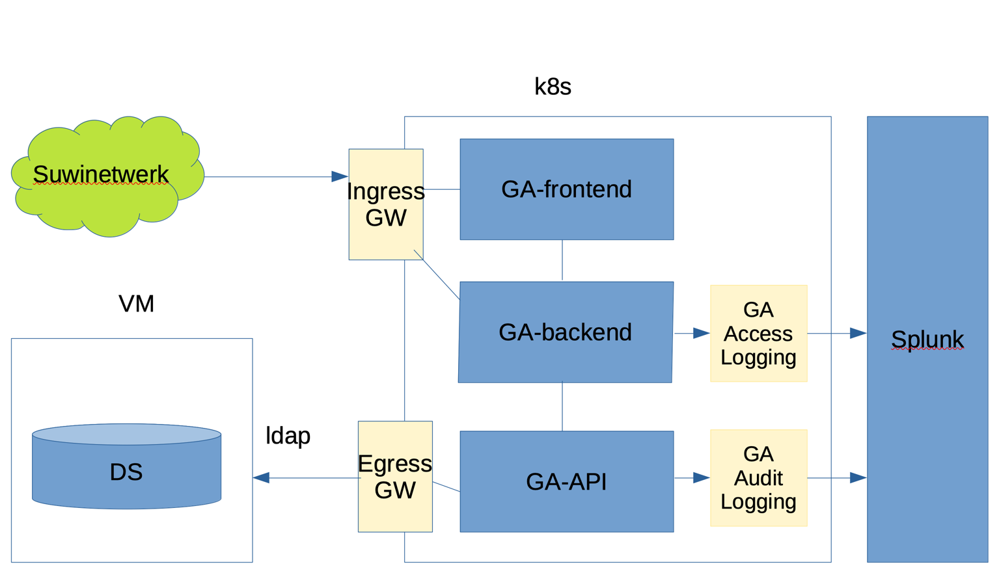

# Technisch Ontwerp van de gebruikersadministratie

[[_TOC_]]

## Introductie

De gebruikers administratie leest de gebruikers uit de ldap database. Deze gebruikers worden per organisatie en per
onderdeel binnen de organisatie opgehaald. In de ldap staat echter niet de lijst van organisaties met per organisatie
welke onderdelen er zijn. Deze informatie moet uit SRM komen. In overleg met architectuur hebben we afgesproken om een
nieuwe export te maken uit SRM waarin deze informatie zit. Deze export wordt gedaan in een GitLab pipeline. Hier wordt
hetzelfde mechanisme gebruikt als nu voor de organization files, maar de frequentie is wel anders. Via de Gitlab 
pipeline komt de export bij de gebruikersadministratie terecht (wordt er naar toe gepushed). Zodra de nieuwe export 
wordt opgemerkt door gebruikersadministratie wordt de export ingelezen en overschrijft daarmee de bestaande organisation
informatie. Tevens wordt er een versie nummer gegeven aan de export, zodat we kunnen zien, loggen enz. met welke versie
we te maken hebben. 
Het idee is nu om de export zelf via Kubernetes/ConfigMap te verspreiden, zodat we het ConfigMap mechanisme zelf gebruiken
om de export te distribueren over de gebruikersadministratie instanties. 

## Overzicht huidige en toekomstige situatie

Hierbij is het onderdeel Gebruikers Administratie momenteel beschikbaar in SI Classic en zal in de toekomst
door het huidige project vervangen worden.

## GA-Access- en GA-Audit-Logging naar Splunk

Hierover is overlegd met Gert Jan Kersten. 

Overzicht van de GA Access Logging en GA Audit Logging in de opzet:

Voorstel:
- Een versie van de audit-service, namelijk feature-branche https://gitlab.bkwi.nl/bvv/audit-service/-/tree/feat-v2,
  dient gebruikt te worden.
- Voor intern dataverkeer is het gewenst [grpc](https://grpc.io/) te gebruiken i.p.v. REST, omdat dit efficiënter is.
  - DA zou dan het eerste team zijn, dat de logging-service op basis van grpc toepast.
  - De functionaliteit is door Aleksey Zakrytnoy ontwikkeld en is volgens Gert Jan werkend.
- Plaats voor GA de audit-service versie in:
  - https://gitlab.bkwi.nl/information-platform
  - Naam: ga-audit-service
  - bvv/audit-service aanpassen naar behoefte (grpc versie nemen).
- Indien wij dezelfde applicatie https://gitlab.bkwi.nl/information-platform/ga-auditservice gebruiken voor zowel
  **Access Logging** als **Audit Logging** dan moet een **splunk.server.index** meegegeven worden bij de invoer.
  - Zo'n index zou dan respectievelijk zijn: **ga-access** en **ga-audit**.
  - De index is nodig om aan Splunk mee te delen welke informatiestroom het betreft.

Onderdeel van de implementatie:
- Kennis van [grpc](https://grpc.io/). Dit kost leertijd.
- De functionaliteit van de ga-audit-service (dus met gebruik van grpc) doornemen.
  - Bekijken hoe het werkt.
  - Eventueel moet deze aangepast worden.
    - 2022-08-15: Volgens Wai Cheung is alleen de protobuf (configuratie toegevoegd) en is de functionaliteit nog niet werkend.
  - Documentatie werking (de functionaliteit zal door andere teams overgenomen worden)
- Bereikbaarheid van de ga-audit-service voor de ga-applicaties.
- Bereikbaarheid van Splunk voor de ga-audit-service.
- Met het rapportage-team (Eric Houtenbos) afspreken hoe de logging content voor hen identificeerbaar (zie boven de indexen)
  en begrijpelijk is. 

[back to main](../README.md) |
[previous](./7_Authenticatie.md) |
[next](./9_BDD_End-to-end_en_Rest-Assured-testen.md)
